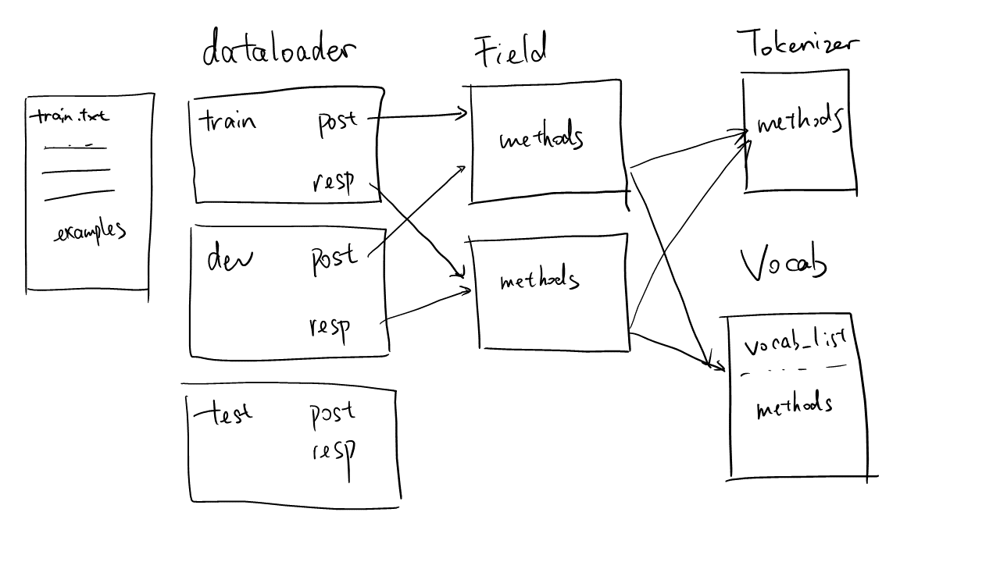

.. _dataloader_reference:

Data Loader
===================================
.. automodule:: cotk.dataloader

Overview
-------------------------------------

Dataloaders are essential components in ``CoTK`` to build models or do fair evaluation.
``CoTK`` uses a dataloader class, :class:`LanguageProcessing`, to handle all the tasks about language.
Here we give an overview of what makes a :class:`LanguageProcessing` dataloader.

* A dataloader may have multiple sets of data. In this case,
  the name of 3 sets (``set_name``) are ``"train"``, ``"dev"``, ``"test"``.
* Each set stores the data read from a text file. In this example,
  3 sets are refered to ``"train.txt"``, ``"dev.txt"``, ``"test.txt"``.
* A set may have multiple data fields. In this case,
  ``"train"`` set have two fields, and their name (``field_name``) are ``"post"`` and ``"resp"``.
* Data fields are specified by :class:`Field` instances.
  :class:`Field` defines the way that the dataloader reads, process, and output the data.
  (But it doesn't store the data, the data is stored in dataloader.)
* A :class:`Field` instance can be shared between data fields.
  In the example, ``"post"`` in ``"train"`` set and ``"post"`` in ``"dev"`` set share an instance.
* :class:`Field` may contains :class:`Tokenizer` and :class:`Vocab`.
* :class:`Tokenizer` defines the methods to tokenize a sentence.
* :class:`Vocab` defines the vocabulary. A instance of :class:`Vocab` can be shared between multiple :class:`Field`, where the data
  from multiple :class:`Field` will be used to construct the vocabulary.

Building a Dataloader
############################################

Predefined Tasks
^^^^^^^^^^^^^^^^^^^^^^^^^^^^^^^^^^^^^^^^^^^^^^

``CoTK`` provides several predefined tasks and benchmarks, including

:class:`LanguageGeneration`
   * :class:`MSCOCO`
:class:`SingleTurnDialog`
   * :class:`OpenSubtitles`
:class:`MultiTurnDialog`
   * :class:`UbuntuCorpus`
   * :class:`SwitchBoard`
:class:`SentenceClassification`
   * :class:`SST`

Choose an adequate class for your task, and it would be the simplest and best way to build a dataloader.
Each class will explain how the dataloader is composed of.

.. _customized_tasks_ref:

Customized Tasks
^^^^^^^^^^^^^^^^^^^^^^^^^^^^^^^^^^^^^^^^^^^^^^

If the predefined classes do not satisfy your need, you can construct an instance of :class:`LanguageProcessing`.

To specify the data format of the customized tasks, the initialization of :class:`LanguageProcessing` receives an argument named ``fields``.
The full description of ``fields`` should be like the example below.

>>> postField = SentenceDefault(...)
>>> respField = SentenceDefault(...)
>>> labelField = DenseLabel(...)
>>> fields = {
>>>    "train": [("post", postField), ("resp", respField)],
>>>    "test": [("post", postField), ('resp', respField), ('label', labelField)]
>>> }
>>> dataloader = LangaugeProcessing("/path/to/dataset", fields)

* ``"train"`` and ``"test"`` is the name of the split sets in the dataset. There should be two text file named ``train.txt`` and ``test.txt``
  under ``/path/to/dataset/``, corresponding to the two sets, ``"train"`` and ``"test"`` respectively.
* ``fields["train"]`` describes the data format of ``train.txt``. Every sample in ``train`` set has two :ref:`data fields<field_ref>`,
  which is represented by :class:`Field` objects.
  As :class:`SentenceDefault` (a subclass of :class:`Field`) only read one line per each sample, a sample in ``train.txt`` occupy two lines.
  The first line are named by ``"post"``, the second line are named ``"resp"``.
* Similarily, ``fields["test"]`` describes the data format of ``test.txt``. Every sample in ``test`` set occupies three lines,
  where the first line is ``"post"``, the second line is ``"resp"``, and the third line is an integer indicating ``"label"``.

An valid input example:

* ``/path/to/dataset/train.txt``

   .. code-block:: none

      How are you?
      I am fine.
      What's up?
      Everything is good.

* ``/path/to/dataset/test.txt``

   .. code-block:: none

      What is your name?
      Jack.
      1
      How about the food?
      Terrible.
      0

The :class:`Field` instances define how dataloaders read the file, process the data, and provide the data to networks.
See :ref:`fields<field_ref>` for further details.

**Omit Set Names**

If you have three sets named ``"train"``, ``"dev"``, ``"test"``, and the data format is the same, you can
specify the ``fields`` argument in initialization of :class:`LanguageProcessing` by the following code:

>>> fields = [("post", postField), ("resp", respField)]

equals to

>>> fields = {
>>>    "train": [("post", postField), ("resp", respField)],
>>>    "dev": [("post", postField), ("resp", respField)],
>>>    "test": [("post", postField), ("resp", respField)]
>>> }

**Use Simple Create**

You can use :func:`LanguageProcessing.simple_create` to initialize a dataloder, using the class name of :class:`Field`
instead of instances. The method receives arguments for initializing subclasses of :class:`Vocab` and :class:`Field`.

>>> fields = {
>>>    "train": [("post", "SentenceDefault"), ("resp", "SentenceDefault")],
>>>    "dev": [("post", "SentenceDefault"), ("resp", "SentenceDefault")],
>>>    "test": [("post", "SentenceDefault"), ("resp", "SentenceDefault")],
>>> }
>>> #or fields = [("post", "SentenceDefault"), ("resp", "SentenceDefault")]
>>> dataloader = LanguageProcessing.simple_create("/path/to/dataset", fields, \
>>>     max_sent_length=10, tokenizer="space", min_frequent_vocab_times=10)

In this example, it will first create an :class:`GeneralVocab` instances with ``min_frequent_vocab_times=10``.
Then it initialize :class:`SentenceDefault` objects with ``max_sent_length=10, tokenizer="space"`` and the created :class:`Vocab`.

.. _dataloader_context_ref:

**Use Context Manager**

There is another way to use the class name of :class:`Field` instead of instances. Initialize the :class:`LanguageProcessing`
in the context of :class:`FieldContext` and :class:`VocabContext`.

>>> fields = [("post", "SentenceDefault"), ("resp", "SentenceDefault")]
>>> with FieldContext.set_parameters(max_sent_length=10, tokenizer="space"):
>>>     with VocabContext.set_parameters(min_frequent_vocab_times=10):
>>>         dataloader = LanguageProcessing("/path/to/dataset", fields)

equals to

>>> fields = [("post", "SentenceDefault"), ("resp", "SentenceDefault")]
>>> dataloader = LanguageProcessing.simple_create("/path/to/dataset", fields, max_sent_length=10, min_frequent_vocab_times=10)

Context is used to provide default values for :class:`Field` and :class:`Vocab` instances.
See :ref:`Context<context_ref>` for further details.

.. _field_ref:

Field
############################################

:class:`Field` indicates data fields, which work secretly behind dataloaders.
They define how dataloaders read the file, process the data, and provide the data to networks.

``Cotk`` provides several fields, including

* :class:`Sentence`
   * :class:`SentenceDefault`
   * :class:`SentenceGPT2`
   * :class:`SentenceBERT`
* :class:`Session`
   * :class:`SessionDefault`
   * :class:`SessionGPT2`
   * :class:`SessionBERT`
* :class:`DenseLabel`
* :class:`SparseLabel`

Note :class:`Field` never stores data, because the instance can be shared between different data fields in dataloader.

Read the File
^^^^^^^^^^^^^^^^^^^^^^^^^^^^^^^^^^^^^^

:class:`Field` defines the way to read the file. For example,

* :class:`Sentence` reads one line per sample, which is a string of sentence.
* :class:`Session` reads multiple lines per sample, stopped when a empty line is read.
* :class:`DenseLabel` reads one line per sample, which is an integer.

See the documentation in each class for details.

Process the Data
^^^^^^^^^^^^^^^^^^^^^^^^^^^^^^^^^^^^^^

Each subclass of :class:`Field` defines the methods to process the input.

For example, :class:`Sentence` processes the sentence into different formats:

* (str) The whole sentences.
* (List[str]) The tokenized sentences.
* (List[id]) The index of tokens in the :ref:`vocabulary<vocabulary_ref>`.

:class:`Sentence` also provides methods to convert a sentence from one format to another:

* :meth:`Sentence.tokenize`
* :meth:`Sentence.convert_ids_to_sentence`
* :meth:`Sentence.convert_sentence_to_ids`
* :meth:`Sentence.convert_tokens_to_ids`
* :meth:`Sentence.convert_ids_to_tokens`

The dataloader has similar methods, which invoke the corresponding methods of the default field.
See :meth:`LanguageProcessing.set_default_field` for details.

Provide the Data to Networks
^^^^^^^^^^^^^^^^^^^^^^^^^^^^^^^^^^^^^^^

Each subclass of :class:`Field` defines :meth:`Field.get_batch`, 
which returns a dict of data for training the networks.

For example, if an instance of :class:`SentenceDefault` is named with ``"sent"``,
:meth:`SentenceDefault.get_batch` will return a dict containing:

* ``sent``
* ``sent_length``
* ``sent_allvocabs``
* ``sent_str``

:meth:`LanguageProcessing.get_batch` will collect dict returned from every field and merge them.
For example, if a dataloader with two :class:`SentenceDefault` fields named ``"post"``, ``"resp"``,
:meth:`LanguageProcessing.get_batch` will return a dict containing:

* ``post``
* ``post_allvocabs``
* ``post_length``
* ``post_str``
* ``reps``
* ``resp_allvocabs``
* ``resp_length``
* ``resp_str``

.. _pretrained_field_ref:

Pretrained Field
^^^^^^^^^^^^^^^^^^^^^^^^^^^^^^^^^^^^^^^^^^^^^

Default fields like :class:`SentenceDefault` and :class:`SessionDefault` are designing
for common use in different language processing task. They use ``<go>`` and ``<eos>`` to mark
the start and the end of sentences.

For some pretrained models like ``GPT2``, ``<go>`` are not pretrained in the vocabulary and thus not available.
We design different field for different pretrained models, including:

* ``gpt2``: :class:`SentenceGPT2`, :class:`SessionGPT2`
* ``bert``: :class:`SentenceBERT`, :class:`SessionBERT`

If you want to use pretrained models (such as GPT2 or BERT) in a predefined dataloader (eg. :class:`LanguageGeneration`),
the parameter ``pretrained`` must be specified (``gpt2`` ot ``bert``) and the ``tokenizer`` must be a :class:`PretrainedTokenizer` object.

.. _tokenizer_ref:

Tokenizer
############################################

:class:`Tokenizer` defines the method to tokenize a sentence, which is used by :class:`Field`.

``CoTK`` provides several tokenizers, including

* :class:`SimpleTokenizer`: A simple tokenizer for general use in ``CoTK``, supporting ``space`` or ``nltk`` tokenization.
* :class:`PretrainedTokenizer`: A pretrained Tokenizer from the ``transformers`` package. For example, tokenizer for ``GPT2``.

When creating a dataloader, it often receives ``str`` or :class:`Tokenizer`.
If ``str``, the following arguments are acceptable:

* ``space``: Split by spaces.
* ``nltk``: ``nltk.tokenize.WordPunctTokenizer`` will be used.

A :class:`SimpleTokenizer` will be created by the ``str`` arguments.

.. _vocabulary_ref:

Vocabulary
############################################

:class:`Vocab` defines the vocabulary, which is used by :class:`Field`.

``CoTK`` provides several vocabularies, including

* :class:`GeneralVocab`: A vocabulary for general use in ``CoTK``. The vocabulary list is often built during the processing of input data.
  Save and load a predefined vocabulary is also supported.
* :class:`PretrainedVocab`: A predefeined vocabulary from the ``transformers`` package. For example, vocabulary for ``GPT2``.

Type of Tokens
^^^^^^^^^^^^^^^^^^^^^^^^^^^^^^^^^^^^^^^^^

All tokens appeared in dataset (including the ones only appear in test set) are split into
2 sets.

    Frequent Vocabularies(``frequent_vocabs``)
        * Tokens that the model **should** read, predict and generate.
        * These tokens are important in evaluation. They include
          common words and usually cover over most of tokens
          from dataset.
        * They are extracted from only training set, because models should be
          blind for test set. Hence they are defined as the tokens appear
          more than a specified number of times (``min_frequent_vocab_times``) in
          **training set**.

    Rare Vocabularies(``rare_vocabs``)
        * Tokens that the model can **optionally** read,
          but will **not** predict and generate at most times
          (**except** some models can generate rare words using
          copy mechanism or external knowledge).
        * These tokens are less important but **DO** affect the evaluation.
        * They are extracted from both training set and test set, because they
          are defined considering evaluation. Hence, they are defined as the tokens
          (excluded ``frequent_vocabs``) appear more than a specified number
          (``min_rare_vocab_times``) of times in **the whole dataset**.

There is also some other terms for vocabularies.

    All Vocabularies(``allvocabs``)
        * The union of `Frequent vocabularies` and `rare vocabularies` is called `all vocabularies`.

    Special Tokens(``special_tokens``)
        * Most used special tokens are ``<pad>``, ``<unk>``, ``<go>``, ``<eos>``.
        * Special tokens are counted as valid vocabularies.

    Unknown tokens (``<unk>``)
        * ``<unk>`` means "Out of Vocabularies", but the meaning of ``<unk>`` may varies from situations.
        * If it appears at a list named with ``allvocabs`` (eg: ``sent_allvocabs``),
          ``<unk>`` indicates a token out of all vocabularies.
        * If it appears at a list named without ``allvocabs`` (eg: ``sent``),
          ``<unk>`` indicates a token out of frequent vocabularies, which means it may a ``rare vocabulary``.

Why CoTK Uses Rare Words
^^^^^^^^^^^^^^^^^^^^^^^^^^^^^^^^^^^^^^^^^^^^^^^^^^^^^

In traditional implementations, vocabulary only contains frequent vocabulary.
``CoTK`` use frequent vocabulary and rare vocabulary for supporting fair comparisons across different configurations.

For examples, we test two models under the same dataset, but with different vocabularies.

* Model A:  Frequent vocabulary ``F_A``; Rare vocabulary ``R_A``.
* Model B:  Frequent vocabulary ``F_B``; Rare vocabulary ``R_B``.

The fairness of comparisons can be gauranteed under the conditions:

* :class:`.metric.PerplexityMetric`: ``F_A + R_A == F_B + R_B``.
* :class:`.metric.BleuCorpusMetric`: ``F_A + R_A == F_B + R_B`` if tokenizer is ``None``; Always fair if tokenizer is set.

See each metrics for when the fairness can be gauranteed.
:ref:`Hash value<metric_hashvalue_ref>` can help user determine whether the comparisons is fair.

.. _vocab_from_ref:

Connecting Field and Vocab
^^^^^^^^^^^^^^^^^^^^^^^^^^^^^^^^^^^^^^^^^^^^^^^^^^^^^^^

:class:`GeneralVocab` is often shared between fields for constructing vocabulary list together.
To identify tokens from a field is regarded as training set or test set
(which may be relative to the division of frequent vocab and rare vocab), :class:`Sentence` use an arguments named ``vocab_from_mappings``.

``vocab_from_mappings`` is a dict, which infer the type of token by the set name. By default:

=============  ========
 **Set Name**  **Type**
-------------  --------
  train         train
  training      train
  dev           test
  development   test
  valid         test
  validation    test
  test          test
  evaluation    test
=============  ========

For example, a token from the ``training`` set will have a type of ``train``.
The type will passed to :meth:`Vocab.add_tokens` as ``vocab_from``.
There are 3 types:

* ``train``: Frequent vocabs are selected from tokens of this type.
* ``test``: Rare vocabs are selected from tokens of this type.
* ``extra``: The tokens of this type will not selected as frequent or rare vocabs.

.. _context_ref:

Context
############################################

:class:`FieldContext` and :class:`VocabContext` are used to set
the default arguments for subclasses of :class:`Field` and :class:`Vocab` respectively.

>>> vocab = GeneralVocab(...)
>>> with FieldContext.set_parameters(vocab=vocab, tokenizer="space", min_frequent_vocab_times=10):
>>>     field = SentenceDefault()

equals to:

>>> vocab = GeneralVocab(...)
>>> field = SentenceDefault(vocab=vocab, tokenizer="space", min_frequent_vocab_times=10)

The context can be stacked, and ``weak`` means whether overwrite the outter context.

>>> vocab = GeneralVocab(...)
>>> with FieldContext.set_parameters(vocab=vocab, tokenizer="space", min_frequent_vocab_times=10):
>>>     with FieldContext.set_parameters(min_frequent_vocab_times=20):
>>>         field1 = SentenceDefault()  # min_frequent_vocab_times=20
>>> with FieldContext.set_parameters(vocab=vocab, tokenizer="space", min_frequent_vocab_times=10):
>>>     with FieldContext.set_parameters(min_frequent_vocab_times=20, weak=True):
>>>         field2 = SentenceDefault()  # min_frequent_vocab_times=10

It usually works with the initialization of :class:`LanguageProcessing` without creating the instance of :class:`Field` or :class:`Vocab`.
See the :ref:`examples<dataloader_context_ref>` here.

.. _dataloader_hash_ref:

Hash Value for Dataloader
############################################

It is usually difficult to track the differences among different configurations,
CoTK provides hash codes to identify each part of dataloader including
the input data, vocabularies and settings.

For example, if two data loaders have the same general hash, their data, vocabularies
and settings are guaranteed to be the same.

:class:`LanguageProcessing` provides the following hash value:

* :meth:`LanguageProcessing.get_raw_data_hash`. Tracking the raw input file before processed.
* :meth:`LanguageProcessing.get_data_hash`. Tracking the data after processed.
* :meth:`LanguageProcessing.get_vocab_hash`. Tracking the vocabulary before processed.
* :meth:`LanguageProcessing.get_setting_hash`. Tracking the settings (arguments of the dataloader).
* :meth:`LanguageProcessing.get_general_hash`. Tracking all above.

Dataloader
------------------------------------
.. autoclass:: Dataloader

    .. automethod:: get_all_subclasses
    .. automethod:: load_class

LanguageProcessing
------------------------------------
.. autoclass:: LanguageProcessing

.. automethod:: LanguageProcessing.simple_create

Tokenizer, Vocabulary, and Field
#########################################
.. autoattribute:: LanguageProcessing.fields
    :annotation:
.. automethod:: LanguageProcessing.get_default_tokenizer
.. automethod:: LanguageProcessing.get_default_vocab
.. automethod:: LanguageProcessing.get_default_field
.. automethod:: LanguageProcessing.set_default_field
.. automethod:: LanguageProcessing.get_field

Batched Data
#########################################

  .. automethod:: LanguageProcessing.get_batch
  .. automethod:: LanguageProcessing.restart
  .. automethod:: LanguageProcessing.get_next_batch
  .. automethod:: LanguageProcessing.get_batches
  .. automethod:: LanguageProcessing.get_all_batch

Sentences and Manipulations
#########################################

.. automethod:: LanguageProcessing.tokenize
.. automethod:: LanguageProcessing.tokenize_sentences
.. automethod:: LanguageProcessing.convert_tokens_to_ids
.. automethod:: LanguageProcessing.convert_ids_to_tokens
.. automethod:: LanguageProcessing.convert_ids_to_sentence
.. automethod:: LanguageProcessing.convert_sentence_to_ids
.. automethod:: LanguageProcessing.add_special_to_ids
.. automethod:: LanguageProcessing.remove_special_in_ids
.. automethod:: LanguageProcessing.process_sentences
.. automethod:: LanguageProcessing.trim_in_ids

Vocabulary
#########################################

.. autoattribute:: LanguageProcessing.frequent_vocab_size
.. autoattribute:: LanguageProcessing.all_vocab_size
.. autoattribute:: LanguageProcessing.frequent_vocab_list
.. autoattribute:: LanguageProcessing.all_vocab_list
.. automethod:: LanguageProcessing.get_special_tokens_mapping
.. automethod:: LanguageProcessing.get_special_tokens_id
.. autoattribute:: LanguageProcessing.pad_id
.. autoattribute:: LanguageProcessing.unk_id
.. autoattribute:: LanguageProcessing.go_id
.. autoattribute:: LanguageProcessing.eos_id

Hash
#########################################

.. automethod:: LanguageProcessing.get_general_hash
.. automethod:: LanguageProcessing.get_raw_data_hash
.. automethod:: LanguageProcessing.get_data_hash
.. automethod:: LanguageProcessing.get_vocab_hash
.. automethod:: LanguageProcessing.get_setting_hash

LanguageGeneration
---------------------------------------
.. autoclass:: LanguageGeneration

    .. automethod:: get_batch
    .. automethod:: get_teacher_forcing_metric
    .. automethod:: get_inference_metric

MSCOCO
#########################################
.. autoclass:: MSCOCO

SingleTurnDialog
-------------------------------------------
.. autoclass:: SingleTurnDialog

    .. automethod:: get_batch
    .. automethod:: get_teacher_forcing_metric
    .. automethod:: get_inference_metric

OpenSubtitles
#########################################
.. autoclass:: OpenSubtitles

MultiTurnDialog
-------------------------------------------
.. autoclass:: MultiTurnDialog

    .. automethod:: get_batch
    .. automethod:: get_teacher_forcing_metric
    .. automethod:: get_inference_metric

UbuntuCorpus
#########################################
.. autoclass:: UbuntuCorpus

SwitchboardCorpus
#########################################
.. autoclass:: SwitchboardCorpus

SentenceClassification
-------------------------------------------
.. autoclass:: SentenceClassification

    .. automethod:: get_batch
    .. automethod:: get_metric

SST
#########################################
.. autoclass:: SST

Field
-------------------------------------

.. autoclass:: Field

    .. automethod:: get_all_subclasses
    .. automethod:: load_class
    .. automethod:: get_vocab
    .. automethod:: get_tokenizer
    .. automethod:: get_batch

Sentence
#########################################
.. autoclass:: Sentence

    .. automethod:: tokenize
    .. automethod:: tokenize_sentences
    .. automethod:: convert_tokens_to_ids
    .. automethod:: convert_ids_to_tokens
    .. automethod:: convert_sentence_to_ids
    .. automethod:: convert_ids_to_sentence
    .. automethod:: add_special_to_ids
    .. automethod:: remove_special_in_ids
    .. automethod:: trim_in_ids
    .. automethod:: process_sentences

    .. autoattribute:: frequent_vocab_size
    .. autoattribute:: all_vocab_size
    .. autoattribute:: frequent_vocab_list
    .. autoattribute:: all_vocab_list
    .. automethod:: get_special_tokens_mapping
    .. automethod:: get_special_tokens_id
    .. autoattribute:: pad_id
    .. autoattribute:: unk_id
    .. autoattribute:: go_id
    .. autoattribute:: eos_id

SentenceDefault
^^^^^^^^^^^^^^^^^^^^^^^^^^^^^^^^^^^^^^^^^^^
.. autoclass:: SentenceDefault

    .. automethod:: get_batch

SentenceGPT2
^^^^^^^^^^^^^^^^^^^^^^^^^^^^^^^^^^^^^^^^^^^
.. autoclass:: SentenceGPT2

    .. automethod:: get_batch

SentenceBERT
^^^^^^^^^^^^^^^^^^^^^^^^^^^^^^^^^^^^^^^^^^^
.. autoclass:: SentenceBERT

    .. automethod:: get_batch

Session
#########################################
.. autoclass:: Session

    .. automethod:: tokenize
    .. automethod:: tokenize_sentences
    .. automethod:: tokenize_sessions
    .. automethod:: convert_tokens_to_ids
    .. automethod:: convert_ids_to_tokens
    .. automethod:: convert_sentence_to_ids
    .. automethod:: convert_ids_to_sentence
    .. automethod:: convert_multi_turn_tokens_to_ids
    .. automethod:: convert_multi_turn_ids_to_tokens
    .. automethod:: add_special_to_ids
    .. automethod:: remove_special_in_ids
    .. automethod:: trim_in_ids
    .. automethod:: multi_turn_trim_in_ids
    .. automethod:: process_sentences
    .. automethod:: process_sessions

    .. autoattribute:: frequent_vocab_size
    .. autoattribute:: all_vocab_size
    .. autoattribute:: frequent_vocab_list
    .. autoattribute:: all_vocab_list
    .. automethod:: get_special_tokens_mapping
    .. automethod:: get_special_tokens_id
    .. autoattribute:: pad_id
    .. autoattribute:: unk_id
    .. autoattribute:: go_id
    .. autoattribute:: eos_id

SessionDefault
^^^^^^^^^^^^^^^^^^^^^^^^^^^^^^^^^^^^^^^^^^^
.. autoclass:: SessionDefault

    .. automethod:: get_batch

SessionGPT2
^^^^^^^^^^^^^^^^^^^^^^^^^^^^^^^^^^^^^^^^^^^
.. autoclass:: SessionGPT2

    .. automethod:: get_batch

SessionBERT
^^^^^^^^^^^^^^^^^^^^^^^^^^^^^^^^^^^^^^^^^^^
.. autoclass:: SessionBERT

    .. automethod:: get_batch

DenseLabel
#########################################
.. autoclass:: DenseLabel

    .. automethod:: get_batch

SparseLabel
#########################################
.. autoclass:: SparseLabel

    .. automethod:: get_batch

Tokenizer
-------------------------------------

.. autoclass:: Tokenizer

    .. automethod:: tokenize
    .. automethod:: tokenize_sentences
    .. automethod:: tokenize_sessions
    .. automethod:: convert_tokens_to_sentence

    .. automethod:: get_setting_hash

SimpleTokenizer
#########################################
.. autoclass:: SimpleTokenizer

Pretrainedtokenizer
#########################################
.. autoclass:: PretrainedTokenizer

    .. automethod:: get_tokenizer_class

Vocab
-------------------------------------

.. autoclass:: Vocab

    .. automethod:: get_all_subclasses
    .. automethod:: load_class
    .. automethod:: add_tokens
    .. automethod:: build_vocab

    .. automethod:: convert_tokens_to_ids
    .. automethod:: convert_ids_to_tokens
    .. autoattribute:: frequent_vocab_size
    .. autoattribute:: all_vocab_size
    .. autoattribute:: frequent_vocab_list
    .. autoattribute:: all_vocab_list
    .. automethod:: get_special_tokens_mapping
    .. automethod:: get_special_tokens_id
    .. autoattribute:: pad_id
    .. autoattribute:: unk_id
    .. autoattribute:: go_id
    .. autoattribute:: eos_id

    .. automethod:: get_setting_hash
    .. automethod:: get_vocab_hash

GeneralVocab
#########################################
.. autoclass:: GeneralVocab

    .. automethod:: from_predefined
    .. automethod:: from_predefined_vocab
    .. automethod:: from_frequent_word
    .. automethod:: from_frequent_word_of_vocab

PretrainedVocab
#########################################
.. autoclass:: PretrainedVocab

    .. autoattribute:: frequent_vocab_list
    .. autoattribute:: all_vocab_list

SimpleVocab
#########################################
.. autoclass:: SimpleVocab

Context
------------------------------------

.. autoclass:: Context

    .. automethod:: get
    .. automethod:: set
    .. automethod:: close

FieldContext
#########################################
.. autoclass:: FieldContext

    .. automethod:: set_parameters

VocabContext
#########################################
.. autoclass:: VocabContext

    .. automethod:: set_parameters
