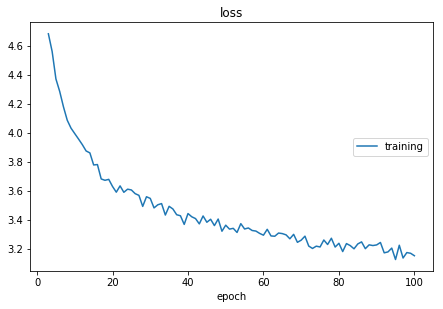

Practice: Implement a GRU Language Model
====================================================

In this tutorial, we will train a neural language model on MSCOCO dataset.
We will focus on how to use ``cotk`` rather than the neural networks,
so we assume you have known how to construct a neural network.

After reading this tutorial, you may know:

- How to use :mod:`cotk.dataloader` downloading and loading dataset.
- How to train model with the support of ``cotk``.
- How to use :mod:`cotk.metric` evaluating models.

``cotk`` does **not** rely on any deep learning framework,
so you can even use shallow models like ngram language model.
However, this tutorial constructs neural networks with
``pytorch``, so make sure you have installed the following package:

- Python >= 3.5
- cotk >= 0.1.0
- pytorch >= 1.0.0
- livelossplot (optional, just for showing loss)

**Source codes**

You can click `here <https://github.com/thu-coai/cotk/blob/master/docs/source/notes/tutorial_core_1.ipynb>`__ for the following ipynb files.  
You can also run `the code <http://colab.research.google.com/github/thu-coai/cotk/blob/master/docs/source/notes/tutorial_core_1.ipynb>`__
**online** on google colab without installing any packages.

Preparing the data
----------------------------------------

``cotk`` provides :mod:`.dataloader` to download, import and preprocess data.
Therefore, we first construct a :class:`cotk.dataloader.MSCOCO` to load MSCOCO dataset.

.. code-block:: python

    from cotk.dataloader import MSCOCO
    from pprint import pprint
    dataloader = MSCOCO("resources://MSCOCO_small") # "resources://MSCOCO_small" is a predefined resources name
    print("Vocab Size:", dataloader.frequent_vocab_size)
    print("First 10 tokens:",  dataloader.frequent_vocab_list[:10])
    print("Dataset is split into:", dataloader.fields.keys())
    data = dataloader.get_batch("train", [0]) # get the sample of id 0
    pprint(data, width=200)
    print(dataloader.convert_ids_to_tokens(data['sent'][0]))

.. rst-class:: sphx-glr-script-out

 Out:

 .. code-block:: none

    INFO: downloading resources
    INFO: name: MSCOCO_small
    INFO: source: default
    INFO: url: https://cotk-data.s3-ap-northeast-1.amazonaws.com/mscoco_small.zip
    INFO: processor: MSCOCO
    100%|██████████| 1020154/1020154 [00:00<00:00, 1265532.43B/s]INFO: resource cached at /root/.cotk_cache/bd12bbf8ce8b157cf620e929bb36379443876ad115951dfeafb63d50b280cff2_temp

    Vocab Size: 2597
    First 10 tokens: ['<pad>', '<unk>', '<go>', '<eos>', '.', 'a', 'A', 'on', 'of', 'in']
    Dataset is split into: dict_keys(['train', 'dev', 'test'])
    {'sent': array([[  2,   6,  67, 653, 550,  11,   5,  65,  89,  10, 115, 352,  83,
              4,   3]]),
     'sent_allvocabs': array([[  2,   6,  67, 653, 550,  11,   5,  65,  89,  10, 115, 352,  83,
              4,   3]]),
     'sent_length': array([15]),
     'sent_str': ['A blue lamp post with a sign for the yellow brick road .']}
    ['A', 'blue', 'lamp', 'post', 'with', 'a', 'sign', 'for', 'the', 'yellow', 'brick', 'road', '.']

:class:`cotk.dataloader.MSCOCO` has helped us construct vocabulary list and
turn the sentences into index representation.

.. note ::
    You can also import dataset from url (http://test.com/data.zip) or
    local path (./data.zip), as long as the format of the data is suitable.

.. note ::
    You may find ``data`` contains similiar key ``sent`` and ``sent_allvocabs``.
    The difference between them is that ``sent`` only contains
    :ref:`valid vocabularies <vocabulary_ref>` and
    ``sent_allvocabs`` contains both :ref:`valid vocabularies <vocabulary_ref>` and
    :ref:`invalid vocabularies <vocabulary_ref>`.

Training models
-----------------------------------------

First we construct a simple GRU Language model using ``pytorch``.

.. code-block:: python

    import torch
    from torch import nn

    embedding_size = 20
    hidden_size = 20

    class LanguageModel(nn.Module):
        def __init__(self):
            super().__init__()
            self.embedding_layer = nn.Embedding(dataloader.frequent_vocab_size, embedding_size)
            self.rnn = nn.GRU(embedding_size, hidden_size, batch_first=True)
            self.output_layer = nn.Linear(hidden_size, dataloader.frequent_vocab_size)
            self.crossentropy = nn.CrossEntropyLoss()

        def forward(self, data):
            # data is the dict returned by ``dataloader.get_batch``
            sent = data['sent']
            sent_length = data['sent_length']
            # sent is a LongTensor whose shape is (batch_size, max(sent_length))
            # sent_length is a list whose size is (batch_size)

            incoming = self.embedding_layer(sent)
            # incoming: (batch_size, max(sent_length), embedding_size)
            incoming, _ = self.rnn(incoming)
            # incoming: (batch_size, max(sent_length), hidden_size)
            incoming = self.output_layer(incoming)
            # incoming: (batch_size, max(sent_length), dataloader.frequent_vocab_size)

            loss = []
            for i, length in enumerate(sent_length):
                if length > 1:
                    loss.append(self.crossentropy(incoming[i, :length-1], sent[i, 1:length]))
                    # every time step predict next token

            data["gen_log_prob"] = nn.LogSoftmax(dim=-1)(incoming)

            if len(loss) > 0:
                return torch.stack(loss).mean()
            else:
                return 0

If you are familiar with GRU, you can see the codes constructed a
network for predicting next token. Then, we will train our model with
the help of ``cotk``. (It may takes several minutes to train the model.)

.. code-block:: python

    from livelossplot import PlotLosses
    import numpy as np

    net = LanguageModel()
    optimizer = torch.optim.Adam(net.parameters(), lr=5e-3)
    epoch_num = 100
    batch_size = 16
    plot = PlotLosses()

    for j in range(epoch_num):
        loss_arr = []
        for i, data in enumerate(dataloader.get_batches("train", batch_size)):
            # convert numpy to torch.LongTensor
            data['sent'] = torch.LongTensor(data['sent'])
            net.zero_grad()
            loss = net(data)
            loss_arr.append(loss.tolist())
            loss.backward()
            optimizer.step()
            if i >= 40:
                break # break for shorten time of an epoch
        plot.update({"loss": np.mean(loss_arr)})
        plot.draw()
        print("epoch %d/%d" % (j+1, epoch_num))

.. rst-class:: sphx-glr-script-out

 Out:

.. code-block:: none

    loss:
    training   (min:    3.161, max:    6.577, cur:    3.239)
    epoch 100/100

Evaluations
-----------------------------------------

How well our model can fit the data? ``cotk`` provides
some standard metrics for language generation model.

Teacher Forcing
~~~~~~~~~~~~~~~~~~~~~~~~~~

``perplexity``
is a common used metric and it need the predicted distribution
over words. Recall we have set ``data["gen_log_prob"]`` in previous
section, we use it right now.

.. code-block:: python

    metric = dataloader.get_teacher_forcing_metric(gen_log_prob_key="gen_log_prob")
    for i, data in enumerate(dataloader.get_batches("test", batch_size)):
        # convert numpy to torch.LongTensor
        data['sent'] = torch.LongTensor(data['sent'])
        with torch.no_grad():
            net(data)
        assert "gen_log_prob" in data
        metric.forward(data)
    pprint(metric.close(), width=150)

.. rst-class:: sphx-glr-script-out

 Out:

 .. code-block:: none

    test set restart, 78 batches and 2 left
    {'perplexity': 34.22552934535805, 'perplexity hashvalue': '2cc7ecfad6f2b41949648225e043d0b2f8bcf283aae5ef773e821f641b8a9763'}

The codes above evaluated the model in teacher forcing mode, where every input
token is the real data. 

.. note ::

    The type of ``data['gen_log_prob']`` is ``torch.Tensor``, but most metrics **do not**
    receive a tensor input as we are trying to implement a library **not**
    depending on any deep learning framework. :class:`.metric.PerplexityMetric` just use ``torch``
    to accelerate the calculation, a :class:`numpy.ndarray` can also be accepted.

Free Run
~~~~~~~~~~~~~~~~~~~~~~~~~~~

A language model can also generate sentences by sending the
generated token back to input in each step. It is called "freerun"
or "inference" mode.

``Pytorch`` doesn't provide a convenience api for freerun, here we implement a
simple version that all the prefixes will be recalculated at every step.

.. code-block:: python

    metric = dataloader.get_inference_metric(gen_key="gen")
    generate_sample_num = 1
    max_sent_length = 20

    for i in range(generate_sample_num):
        # convert numpy to torch.LongTensor
        data['sent'] = torch.LongTensor([[dataloader.go_id] for _ in range(batch_size)])
        data['sent_length'] = np.array([1 for _ in range(batch_size)])
        for j in range(max_sent_length):
            with torch.no_grad():
                net(data)
                generated_token = torch.multinomial(data['gen_log_prob'].exp()[:, -1], 1)
            data['sent'] = torch.cat([data['sent'], generated_token], dim=-1)

        metric.forward({"gen": data['sent'][:, 1:].tolist()})
    pprint(metric.close(), width=250)

Out:

.. code-block:: none

    100%|██████████| 1000/1000 [00:00<00:00, 1104.71it/s]
    100%|██████████| 1250/1250 [00:01<00:00, 1092.16it/s]
    {'bw-bleu': 0.0552594607682451,
     'fw-bleu': 0.26895525176213,
     'fw-bw-bleu': 0.0916819725247384,
     'fw-bw-bleu hashvalue': 'b8b072913c122176b5a4bd3954eb1f48c921bb6c9e90b0e4547f2ad98cee56a5',
     'gen': [['A', 'herd', 'of', 'items', 'with', 'different', 'toppings', 'on', 'a', 'snow', 'competition', '.'],
         ['A', 'woman', 'oven', 'sits', 'decorated', 'and', 'forks', 'and', 'flowers', '.'],
         ['A', 'couple', 'of', '<unk>', 'made', 'with', 'into', 'a', 'container', 'of', 'people', '.'],
         ['A', 'person', 'sitting', 'at', 'the', 'snow', 'flower', 'by', 'a', 'drink', 'shows', 'his', 'giraffe', '.'],
         ['A', 'girl', 'standing', 'on', 'the', 'wall', 'outfit', 'in', 'the', 'pedestrian', 'roses', '.'],
         ['A', 'young', 'girl', 'is', 'standing', 'by', 'businesses', 'raised', '.'],
         ['A', 'small', 'baseball', 'pitcher', 'down', 'a', 'tennis', 'ball', '.'],
         ['A', 'boat', 'and', 'bananas', 'train', 'in', 'a', 'field', '.'],
         ['A', 'white', 'double', 'decker', 'dock', 'sitting', 'inside', 'of', 'an', 'airplane', '.'],
         ['A', 'boy', 'being', 'transit', 'fire', 'hydrant', 'in', 'a', 'room', '.'],
         ['A', 'white', 'sink', '<unk>', 'a', 'vase', 'with', 'two', 'drinks', '.'],
         ['A', 'very', 'cute', 'black', 'clock', 'sitting', 'on', 'ski', '<unk>', 'near', 'a', 'hallway', '.'],
         ['A', 'large', 'plate', 'sliced', 'with', 'tomatoes', 'in', 'the', 'water', '.'],
         ['A', 'plane', 'with', 'a', 'laptop', 'and', 'set', 'of', 'furniture', '.'],
         ['A', 'person', 'sitting', 'on', 'a', 'skateboard', 'walk', 'a', 'dirt', 'area', 'near', 'the', '.'],
         ['A', 'young', 'boy', 'laying', 'around', 'with', 'a', 'red', 'table', '.']],
    'self-bleu': 0.05696094523203348,
    'self-bleu hashvalue': '90865484e69f47cf7aea7f89b1b1b563972ed140e8f0e6e8ec8064b7155c534c'}

Hash value
~~~~~~~~~~~~~~~~~~

Hash value is for checking whether you use the test set correctly.
We can refer to the `dashboard <http://coai.cs.tsinghua.edu.cn/dashboard/>`__ for the state of art on this dataset,
and we find our hashvalue is correct.

However, if teacher forcing is tested as following codes, we will
see a different hash value, which means the implementation is not correct.

.. code-block:: python

    metric = dataloader.get_teacher_forcing_metric(gen_log_prob_key="gen_log_prob")
    for i, data in enumerate(dataloader.get_batches("test", batch_size)):
        # convert numpy to torch.LongTensor
        data['sent'] = torch.LongTensor(data['sent'])
        with torch.no_grad():
            net(data)
        assert "gen_log_prob" in data
        metric.forward(data)
        if i >= 15: #ignore the following batches leading to an incorrect implementation
            break
    pprint(metric.close(), width=150)

Out:

.. code-block:: none

    test set restart, 78 batches and 2 left
    {'perplexity': 31.935582929323076, 'perplexity hashvalue': 'd38265b09387b07be8461f54a7879250b196b0f5bbd3669dc5c6cd17958d81f8'}

Additional: Word Vector
----------------------------------------

It is a common technique to use pre-trained word vector when
processing natural languages. ``cotk`` also provides a module :mod:`.wordvector`
that help you downloading and get word vectors.

.. code-block:: python

    from cotk.wordvector import Glove
    wordvec = Glove("resources://Glove50d_small")
    self.embedding_layer.weight = nn.Parameter(torch.Tensor(wordvec.load(embedding_size, dataloader.frequent_vocab_list)))

We can add these lines at the end of ``LanguageModel.__init__``.

**Source code**

You can find the results and codes with pretrained word vector at
`here <https://github.com/thu-coai/cotk/blob/master/docs/source/notes/tutorial_core_2.ipynb>`__ for ipynb files
or run `the code <http://colab.research.google.com/github/thu-coai/cotk/blob/master/docs/source/notes/tutorial_core_2.ipynb>`__
on google colab.

