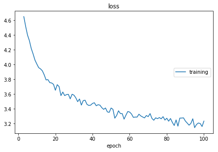

Practice: Implement a GRU Language Model
====================================================

In this tutorial, we will train a neural language model on MSCOCO dataset.
We will focus on how to use ``cotk`` rather than the neural networks,
so we assume you have known how to construct a neural network.

After reading this tutorial, you may know:

- How to use :mod:`cotk.dataloader` downloading and loading dataset.
- How to train model with the support of ``cotk``.
- How to use :mod:`cotk.metric` evaluating models.

``cotk`` does **not** rely on any deep learning framework,
so you can even use shallow models like ngram language model.
However, this tutorial constructs neural networks with
``pytorch``, so make sure you have installed the following package:

- Python >= 3.5
- cotk
- pytorch >= 1.0.0
- livelossplot (optional, just for showing loss)

**Source codes**

You can click `here <https://github.com/thu-coai/cotk/blob/master/docs/source/notes/tutorial_core_1.ipynb>`__ for the following ipynb files.  
You can also run `the code <http://colab.research.google.com/github/thu-coai/cotk/blob/master/docs/source/notes/tutorial_core_1.ipynb>`__
**online** on google colab without installing any packages.

Preparing the data
----------------------------------------

``cotk`` provides :mod:`.dataloader` to download, import and preprocess data.
Therefore, we first construct a :class:`cotk.dataloader.MSCOCO` to load MSCOCO dataset.

.. code-block:: python

    from cotk.dataloader import MSCOCO
    from pprint import pprint
    dataloader = MSCOCO("resources://MSCOCO_small") # "resources://MSCOCO_small" is a predefined resources name
    print("Vocab Size:", dataloader.vocab_size)
    print("First 10 tokens:",  dataloader.vocab_list[:10])
    print("Dataset is split into:", dataloader.key_name)
    data = dataloader.get_batch("train", [0]) # get the sample of id 0
    pprint(data, width=200)
    print(dataloader.convert_ids_to_tokens(data['sent'][0]))

.. rst-class:: sphx-glr-script-out

 Out:

 .. code-block:: none

    INFO: name: MSCOCO_small
    INFO: source: default
    INFO: processor type: MSCOCO

    100%|██████████| 1020154/1020154 [00:00<00:00, 1853831.54B/s]

    INFO: resource cached at /root/.cotk_cache/9e4c0afe33d98fa249e472206a39e5553d739234d0a27e055044ae8880e314b1_unzip/mscoco
    valid vocab list length = 2588
    vocab list length = 12411
    train set. invalid rate: 0.031716, unknown rate: 0.000000, max length before cut: 55, cut word rate: 0.000022
    dev set. invalid rate: 0.034089, unknown rate: 0.000000, max length before cut: 46, cut word rate: 0.000000
    test set. invalid rate: 0.031213, unknown rate: 0.000000, max length before cut: 27, cut word rate: 0.000000
    Vocab Size: 2588
    First 10 tokens: ['<pad>', '<unk>', '<go>', '<eos>', '.', 'a', 'A', 'on', 'of', 'in']
    Dataset is split into: ['train', 'dev', 'test']
    {'sent': array([[  2,   6,  67, 651, 549,  11,   5,  65,  89,  10, 115, 349,  83,
            4,   3]]),
    'sent_allvocabs': array([[  2,   6,  67, 651, 549,  11,   5,  65,  89,  10, 115, 349,  83,
            4,   3]]),
    'sent_length': array([15])}
    ['<go>', 'A', 'blue', 'lamp', 'post', 'with', 'a', 'sign', 'for', 'the', 'yellow', 'brick', 'road', '.']

:class:`cotk.dataloader.MSCOCO` has helped us construct vocabulary list and
turn the sentences into index representation.

.. note ::
    You can also import dataset from url (http://test.com/data.zip) or
    local path (./data.zip), as long as the format of the data is suitable.

.. note ::
    You may find ``data`` contains similiar key ``sent`` and ``sent_allvocabs``.
    The difference between them is that ``sent`` only contains
    :ref:`valid vocabularies <vocab_ref>` and
    ``sent_allvocabs`` contains both :ref:`valid vocabularies <vocab_ref>` and
    :ref:`invalid vocabularies <vocab_ref>`.

Training models
-----------------------------------------

First we construct a simple GRU Language model using ``pytorch``.

.. code-block:: python

    import torch
    from torch import nn

    embedding_size = 20
    hidden_size = 20

    class LanguageModel(nn.Module):
        def __init__(self):
            super().__init__()
            self.embedding_layer = nn.Embedding(dataloader.vocab_size, embedding_size)
            self.rnn = nn.GRU(embedding_size, hidden_size, batch_first=True)
            self.output_layer = nn.Linear(hidden_size, dataloader.vocab_size)
            self.crossentropy = nn.CrossEntropyLoss()

        def forward(self, data):
            # data is the dict returned by ``dataloader.get_batch``
            sent = data['sent']
            sent_length = data['sent_length']
            # sent is a LongTensor whose shape is (batch_size, max(sent_length))
            # sent_length is a list whose size is (batch_size)

            incoming = self.embedding_layer(sent)
            # incoming: (batch_size, max(sent_length), embedding_size)
            incoming, _ = self.rnn(incoming)
            # incoming: (batch_size, max(sent_length), hidden_size)
            incoming = self.output_layer(incoming)
            # incoming: (batch_size, max(sent_length), dataloader.vocab_size)

            loss = []
            for i, length in enumerate(sent_length):
                if length > 1:
                    loss.append(self.crossentropy(incoming[i, :length-1], sent[i, 1:length]))
                    # every time step predict next token

            data["gen_log_prob"] = nn.LogSoftmax(dim=-1)(incoming)

            if len(loss) > 0:
                return torch.stack(loss).mean()
            else:
                return 0

If you are familiar with GRU, you can see the codes constructed a
network for predicting next token. Then, we will train our model with
the help of ``cotk``. (It may takes several minites too train the model.)

.. code-block:: python

    from livelossplot import PlotLosses
    import numpy as np

    net = LanguageModel()
    optimizer = torch.optim.Adam(net.parameters(), lr=5e-3)
    epoch_num = 100
    batch_size = 16
    plot = PlotLosses()

    for j in range(epoch_num):
        loss_arr = []
        for i, data in enumerate(dataloader.get_batches("train", batch_size)):
            # convert numpy to torch.LongTensor
            data['sent'] = torch.LongTensor(data['sent'])
            net.zero_grad()
            loss = net(data)
            loss_arr.append(loss.tolist())
            loss.backward()
            optimizer.step()
            if i >= 40:
                break # break for shorten time of an epoch
        plot.update({"loss": np.mean(loss_arr)})
        plot.draw()
        print("epoch %d/%d" % (j+1, epoch_num))

.. rst-class:: sphx-glr-script-out

 Out:

.. code-block:: none

    loss:
    training   (min:    3.126, max:    6.401, cur:    3.152)
    epoch 100/100

Evaluations
-----------------------------------------

How well our model can fit the data? ``cotk`` have provided
some standard metrics for language generation model.

Teacher Forcing
~~~~~~~~~~~~~~~~~~~~~~~~~~

``perplexity``
is a common used metric and it need the predicted distribution
over words. Recall we have set ``data["gen_log_prob"]`` in previous
section, we use it right now.

.. code-block:: python

    metric = dataloader.get_teacher_forcing_metric(gen_log_prob_key="gen_log_prob")
    for i, data in enumerate(dataloader.get_batches("test", batch_size)):
        # convert numpy to torch.LongTensor
        data['sent'] = torch.LongTensor(data['sent'])
        with torch.no_grad():
            net(data)
        assert "gen_log_prob" in data
        metric.forward(data)
    pprint(metric.close(), width=150)

.. rst-class:: sphx-glr-script-out

 Out:

 .. code-block:: none

    test set restart, 78 batches and 2 left
    {'perplexity': 32.94079849259241, 'perplexity hashvalue': '4f101c2986f1fe10ce1d2197c3086d3659aec3e6495f381d67f00b4dbb40a538'}

The codes above evaluated the model in teacher forcing mode, where every input
token is the real data. 

.. note ::

    The type of ``data['gen_log_prob']`` is ``torch.Tensor``, but most metrics can
    **not** receive a tensor input as we are trying to implement a library **not**
    depending on any deep learning framework. :class:`.metric.PerplexityMetric` just use ``torch``
    to accelerate the calculation, a :class:`numpy.ndarray` can also be accepted.

Free Run
~~~~~~~~~~~~~~~~~~~~~~~~~~~

A language model can also generate sentences by sending the
generated token back to input in each step. We call it "freerun"
or "inference" mode.

``Pytorch`` doesn't provide a convenience api for freerun, here we implement a
simple version that all the prefixes will be recalculated at every step.

.. code-block:: python

    metric = dataloader.get_inference_metric(gen_key="gen")
    generate_sample_num = 1
    max_sent_length = 20

    for i in range(generate_sample_num):
        # convert numpy to torch.LongTensor
        data['sent'] = torch.LongTensor([[dataloader.go_id] for _ in range(batch_size)])
        data['sent_length'] = np.array([1 for _ in range(batch_size)])
        for j in range(max_sent_length):
            with torch.no_grad():
                net(data)
                generated_token = torch.multinomial(data['gen_log_prob'].exp()[:, -1], 1)
            data['sent'] = torch.cat([data['sent'], generated_token], dim=-1)

        metric.forward({"gen": data['sent'][:, 1:].tolist()})
    pprint(metric.close(), width=250)

Out:

.. code-block:: none

    100%|██████████| 1000/1000 [00:00<00:00, 1063.21it/s]
    {'bw-bleu': 0.04871277607530735,
     'fw-bleu': 0.22873635755754274,
     'fw-bw-bleu': 0.08032018568655393,
     'fw-bw-bleu hashvalue': '3018dc317f82b6013f011c1f8ccd90c5affed710b7d7d06a7235cf455c233542',
     'gen': [['A', 'red', 'bus', 'car', 'being', 'snow', 'behind', 'much', 'to', 'it', '.'],
             ['The', 'pair', 'of', 'cover', 'position', 'two', 'vases', 'screen', '.'],
             ['A', 'black', 'dog', 'walking', 'from', 'a', 'bush', '.'],
             ['The', 'zebra', 'sits', 'in', 'front', 'of', 'a', 'bathroom', 'lamp', '.'],
             ['<unk>', 'single', 'boys', 'using', 'a', 'baseball', 'game', ',', 'holds', 'her', 'dog', '.'],
             ['A', 'picture', 'of', 'a', 'shopping', 'colored', 'restroom', 'with', 'broccoli', 'on', 'it', '.'],
             ['A', 'people', 'that', 'is', 'stopped', 'seen', 'on', 'back', 'it', '.'],
             ['A', 'street', 'holding', 'black', 'with', 'grass', 'up', 'up', 'at', 'a', 'white', 'mirror', '.'],
             ['A', 'cow', 'sits', 'in', 'front', 'of', 'the', 'bowl', 'with', 'a', 'pan', 'are', 'playing'],
             ['A', 'woman', 'looking', 'hardwood', '<unk>', 'of', 'some', 'is', 'open', '.'],
             ['A', 'fire', 'hydrant', 'taking', 'a', 'red', 'toy', 'feet', '.'],
             ['A', 'woman', 'is', 'flying', 'on', 'a', 'cell', 'phone', 'somewhere', '.'],
             ['A', 'bear', 'holding', 'a', 'hill', 'suit', 'it', 'on', 'a', 'wooden', 'board', '.'],
             ['Woman', 'playing', 'frisbee', 'below', 'food', 'across', 'the', 'ocean', '.'],
             ['There', 'has', 'some', 'two', 'rice', 'screens', 'with', 'several', 'colorful', 'toy', 'on', 'a', 'white', 'tile', 'toilet', '.'],
             ['Large', '<unk>', 'with', 'many', 'pretty', 'an', 'apple', '.']],
     'self-bleu': 0.07416490324471028,
     'self-bleu hashvalue': '9f1121d3988ef4789943ef18c1c0b749eec0d8eee3f12270671605ce670225f6'}

Hash value
~~~~~~~~~~~~~~~~~~

Hash value is for checking whether you use the test set correctly.
We can refer to dashboard (TO BE ONLINE) for the state of art on this dataset,
and we find our hashvalue is correct.

However, if teacher forcing is tested as following codes, we will
see a different hash value, which means the implementation is not correct.

.. code-block:: python

    metric = dataloader.get_teacher_forcing_metric(gen_log_prob_key="gen_log_prob")
    for i, data in enumerate(dataloader.get_batches("test", batch_size)):
        # convert numpy to torch.LongTensor
        data['sent'] = torch.LongTensor(data['sent'])
        with torch.no_grad():
            net(data)
        assert "gen_log_prob" in data
        metric.forward(data)
        if i >= 15: #ignore the following batches
            break
    pprint(metric.close(), width=150)

Out:

.. code-block:: none

    test set restart, 78 batches and 2 left
    {'perplexity': 31.883897093289583, 'perplexity hashvalue': '125a45af618245364a722ad3fcac59534f30e64aa7e2dfefd35402cd67a74cec'}

Additional: Word Vector
----------------------------------------

It is a common technique to use pre-trained word vector when
processing natural languages. ``cotk`` also provides a module :mod:`.wordvector`
that help you downloading and get word vectors.

.. code-block:: python

    from cotk.wordvector import Glove
    wordvec = Glove("resources://Glove50d_small")
    self.embedding_layer.weight = nn.Parameter(torch.Tensor(wordvec.load(embedding_size, dataloader.vocab_list)))

We can add these lines at the end of ``LanguageModel.__init__``.

**Source code**

You can find the results and codes with pretrained word vector at
`here <https://github.com/thu-coai/cotk/blob/master/docs/source/notes/tutorial_core_2.ipynb>`__ for ipynb files
or run `the code <http://colab.research.google.com/github/thu-coai/cotk/blob/master/docs/source/notes/tutorial_core_2.ipynb>`__
on google colab.
