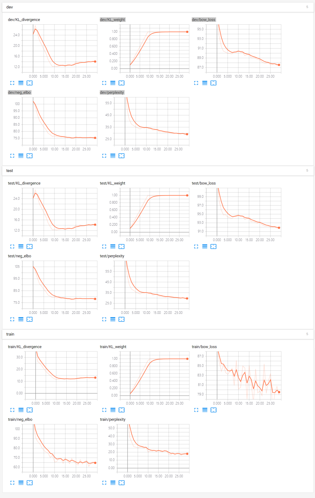

## CVAE (TensorFlow)

CVAE is a basic model for multiple turn dialog. You can refer to the following papers for details:

Zhao, T., Zhao, R., & Eskenazi, M. (2017). Learning discourse-level diversity for neural dialog models using conditional variational autoencoders. arXiv preprint arXiv:1703.10960.


### Require Packages

* cotk
* TensorFlow == 1.13.1
* TensorBoardX >= 1.4

### Quick Start

* Execute ``python run.py`` to train the model.
  * The default dataset is ``SwitchboardCorpus``. You can use ``--dataset`` to specify other ``dataloader`` class.
  * It don't use pretrained word vector by default setting. You can use ``--wvclass`` to specify ``wordvector`` class. For example: ``--wvclass gloves``
  * If you don't have GPUs, you can add `--cpu` for switching to CPU, but it may cost very long time.
* You can view training process by tensorboard, the log is at `./tensorboard`.
  * For example, ``tensorboard --logdir=./tensorboard``. (You have to install tensorboard first.)
* After training, execute  ``python run.py --mode test --restore best`` for test.
  * You can use ``--restore filename`` to specify checkpoints files, which are in ``./model``.
  * ``--restore last`` means last checkpoint, ``--restore best`` means best checkpoints on dev.
* Find results at ``./output``.

### Arguments

```none
    usage: run.py [-h] [--name NAME] [--restore RESTORE] [--mode MODE]
                  [--dataset DATASET] [--datapath DATAPATH] [--epoch EPOCH]
                  [--wvclass WVCLASS] [--wvpath WVPATH] [--out_dir OUT_DIR]
                  [--log_dir LOG_DIR] [--model_dir MODEL_DIR]
                  [--cache_dir CACHE_DIR] [--cpu] [--debug] [--cache]
    
    optional arguments:
      -h, --help            show this help message and exit
      
    useful arguments:
      --name NAME           The name of your model, used for variable scope and 
                            tensorboard, etc.
                            Default: runXXXXXX_XXXXXX (initialized by current time)
      --restore RESTORE     Checkpoints name to load. "last" for last checkpoints,
                            "best" for best checkpoints on dev. Attention: "last"
                            and "best" wiil cause unexpected behaviour when run 2
                            models in the same dir at the same time. Default: None
                            (dont load anything)
      --mode MODE           "train" or "test". Default: train
      --dataset DATASET     Dataloader class. Default: OpenSubtitles
      --datapath DATAPATH   Directory for data set. Default: ./data
      --epoch EPOCH         Epoch for trainning. Default: 100
      --wvclass WVCLASS     Wordvector class, none for not using pretrained
                            wordvec. Default: None
      --wvpath WVPATH       Directory for pretrained wordvector. Default:
                            ./wordvec
    
    advanced arguments:
      --out_dir OUT_DIR     Output directory for test output. Default: ./output
      --log_dir LOG_DIR     Log directory for tensorboard. Default: ./tensorboard
      --model_dir MODEL_DIR
                            Checkpoints directory for model. Default: ./model
      --cache_dir CACHE_DIR
                            Checkpoints directory for cache. Default: ./cache
      --cpu                 Use cpu.
      --debug               Enter debug mode (using ptvsd).
      --cache               Use cache for speeding up load data and wordvec. (It
                       	    may cause problems when you switch dataset.)
```

### TensorBoard Example

Execute ``tensorboard --logdir=./tensorboard``, you will see the plot in tensorboard pages:



Following plot are shown in this model:

* train/loss
* train/perplexity
* dev/loss
* dev/perplexity
* test/loss
* test/perplexity

### Case Study of Model Results

Execute ``python run.py --mode test --restore best``

The following output will be in `./output/[name]_[dev|test].txt`:

```none
perplexity:	46.376537
bleu:	0.077950
session: 	0
	post:	<d> <eos>
	resp:	alright what do you think <eos>
	gen:	<go> i don't know i'm not sure that we have to be in the country and <eos>

	post:	alright what do you think <eos>
	resp:	well i think air pollution is a pretty big problem right now and it's i mean i think it's a real bad problem i don't think that a lot is really being done about it at this point <eos> and there's just things like for a i think that
	gen:	<go> i'm not going to have to pay this much more than what i consider <eos>

	post:	well i think air pollution is a pretty big problem right now and it's i mean i think it's a real bad problem i don't think that a lot is really being done about it at this point <eos> and there's just things like for a i think that
	resp:	right <eos>
	gen:	<go> yeah <eos> well i think it will be interesting to start getting ready for the next week <eos>

	post:	right <eos>
	resp:	and if you look at other countries like in the third world and stuff where people ride bikes and all that i'm sure that their <eos> air quality is much better than ours just as a result of their lack of having cars like if you look at los
	gen:	<go> i don't know i don't know i don't know i think that i think that the reason i have been working for a lot of people say that i work for a company and i think that i think that the people that have been working for the ti and

	post:	and if you look at other countries like in the third world and stuff where people ride bikes and all that i'm sure that their <eos> air quality is much better than ours just as a result of their lack of having cars like if you look at los
	resp:	hum okay well i mean also along the same lines i know that there's somebody i read one time about somebody's developed a test to look at the emissions from your car <eos>
	gen:	<go> uh-huh <eos>

	post:	hum okay well i mean also along the same lines i know that there's somebody i read one time about somebody's developed a test to look at the emissions from your car <eos>
	resp:	uh-huh <eos> right <eos>
	gen:	<go> yeah <eos> yeah <eos> well i have to say that i have a pretty small town there that i used to be in the air force and i used to be a little bit of the ground <eos>

...

```

### Performance

|               | SwitchboardCorpus |
| ------------- | ----------------- |
| Perplexity (KL) | 21.70 (12.20) |
| BLEU-1 precision | 0.13610 |
| BLEU-1 recall | 0.04108 |
| BLEU-2 precision | 0.02238 |
| BLEU-2 recall | 0.00617 |
| BLEU-3 precision | 0.00398 |
| BLEU-3 recall | 0.00115 |
| BLEU-4 precision | 0.00052 |
| BLEU-4 recall | 0.00016 |
| avg-bow precision | 0.94545 |
| avg-bow recall | 0.23039 |
| extrema-bow precision | 0.90231 |
| extrema-bow recall | 0.21620 |

### Author

[Shao Zhihong](https://github.com/ZhihongShao)
