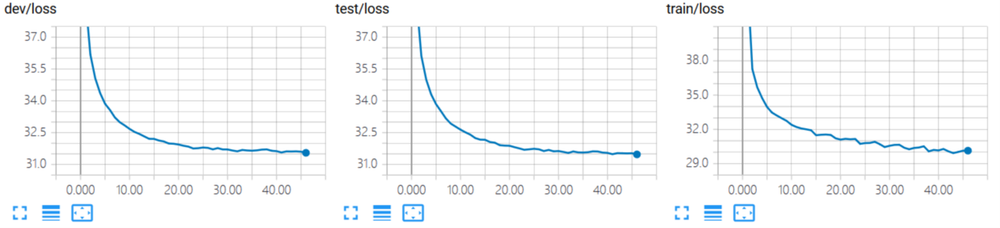
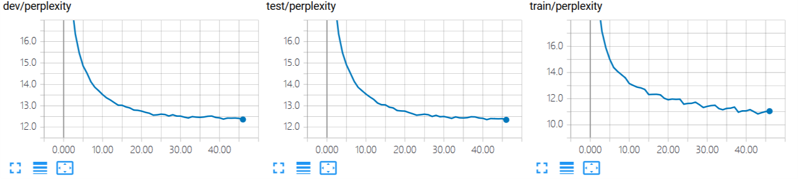

## Language Model (TensorFlow)


An implementation of LM(language model).


### Require Packages

- cotk
- TensorFlow == 1.13.1
- TensorBoardX >= 1.4


### Quick Start

- Downloading dataset and save it to ``./data``. (Dataset will be released soon.)
- Execute ``python run.py`` to train the model.
  - The default dataset is ``MSCOCO``. You can use ``--dataset`` to specify other ``dataloader`` class.
  - It use `gloves`  pretrained word vector by default setting. You can use ``--wvclass`` to specify ``wordvector`` class.
  - If you don't have GPUs, you can add `--cpu` for switching to CPU, but it may cost very long time.
- You can view training process by tensorboard, the log is at `./tensorboard`.
  - For example, ``tensorboard --logdir=./tensorboard``. (You have to install tensorboard first.)
- After training, execute  ``python run.py --mode test --restore best`` for test.
  - You can use ``--restore filename`` to specify checkpoints files, which are in ``./model``.
  - ``--restore last`` means last checkpoint, ``--restore best`` means best checkpoints on dev.
- Find results at ``./output``.


### Arguments

```none
    usage: run.py [-h] [--name NAME] [--restore RESTORE] [--mode MODE]
                  [--dataset DATASET] [--datapath DATAPATH] [--epoch EPOCH]
                  [--wvclass WVCLASS] [--wvpath WVPATH] [--out_dir OUT_DIR]
                  [--log_dir LOG_DIR] [--model_dir MODEL_DIR]
                  [--cache_dir CACHE_DIR] [--cpu] [--debug] [--cache]

    optional arguments:
      -h, --help            show this help message and exit
      --name NAME           The name of your model, used for variable scope and
                            tensorboard, etc. Default: runXXXXXX_XXXXXX
                            (initialized by current time)
      --restore RESTORE     Checkpoints name to load. "last" for last checkpoints,
                            "best" for best checkpoints on dev. Attention: "last"
                            and "best" wiil cause unexpected behaviour when run 2
                            models in the same dir at the same time. Default: None
                            (dont load anything)
      --mode MODE           "train" or "test". Default: train
      --dataset DATASET     Dataloader class. Default: MSCOCO
      --datapath DATAPATH   Directory for data set. Default: ./data
      --epoch EPOCH         Epoch for trainning. Default: 10
      --wvclass WVCLASS     Wordvector class, None for using Glove pretrained
                            wordvec. Default: None
      --wvpath WVPATH       Path for pretrained wordvector. Default: wordvec
      --out_dir OUT_DIR     Output directory for test output. Default: ./output
      --log_dir LOG_DIR     Log directory for tensorboard. Default: ./tensorboard
      --model_dir MODEL_DIR
                            Checkpoints directory for model. Default: ./model
      --cache_dir CACHE_DIR
                            Checkpoints directory for cache. Default: ./cache
      --cpu                 Use cpu.
      --debug               Enter debug mode (using ptvsd).
      --cache               Use cache for speeding up load data and wordvec. (It
                            may cause problems when you switch dataset.)
```

For hyperparameter settings, please refer to `run.py`.


### TensorBoard Example

Execute ``tensorboard --logdir=./tensorboard``, you will see the plot in tensorboard pages:

Following plot are shown in this model:

- loss: reconstruction loss.

  

- perplexity: reconstruction perplexity.

  


And text output:

```none

"epochs": 10,  
"lr": 0.1,  
"log_dir": "./tensorboard",  
"name": "LM",  
"max_sen_length": 50,  
"checkpoint_max_to_keep": 5,  
"embedding_size": 300,  
"momentum": 0.9,  
"checkpoint_steps": 1000,  
"datapath": "resources://MSCOCO~tsinghua",  
"cache": false,  
"debug": false,  
"wvclass": null,  
"restore": "last",  
"show_sample": [  
0
],  
"wvpath": null,  
"dh_size": 200,  
"batch_size": 128,  
"lr_decay": 0.995,  
"model_dir": "./model",  
"out_dir": "./output",  
"cache_dir": "./cache",  
"softmax_samples": 512,  
"mode": "train",  
"grad_clip": 5.0,  
"dataset": "MSCOCO",  
"cuda": true  

```


Following text are shown in this model:

- args


### Case Study of Model Results

Execute ``python run.py --mode test --restore last``

The following output will be in `./output/[name]_test.txt`:

```none
self-bleu-3:	0.709417
bw-bleu-3:	0.513164
self-bleu-4:	0.515631
bw-bleu-4:	0.336216
self-bleu-2:	0.870640
fw-bw-bleu-3:	0.550495
perplexity:	13.409582
fw-bleu-4:	0.371952
fw-bleu-2:	0.836639
fw-bw-bleu-4:	0.353182
fw-bleu-3:	0.593684
bw-bleu-2:	0.723493
fw-bw-bleu-2:	0.775963
A man and motorcycle parked on front of a building .
A old desk with a computers computers of computers .
A people in to a table in to a tree sign
A man dog with a in in a bathroom bathroom .
A man young plate to be served by a people .
A man is on a bench next front park of a woods .
A man is a piece feeder 's a in
A man of a old man in a small .
A man is on a bench next looking dog is on her fence . the park station .
A old man is standing a orange tie .
A man is in a dog in to a .
A old desk a and and a and desk .
A of and and a black and a .
A man is a man sitting to a table sign
A up of a plate plate with with a stove pot . the .
A man plate top oven in of kitchen .
A man is on a small cars in a street field .
A man of people are down a street lined street .
A man is in two legs and in a couch . a .
A man is two legs of a person on out a television .
A in a helmet a on front of a building of people .
A man is standing on a dog on a laptop .

```


### Performance

|        | Perplexity |
| ------ | ------------------------- |
| MSCOCO | 13.41                     |

