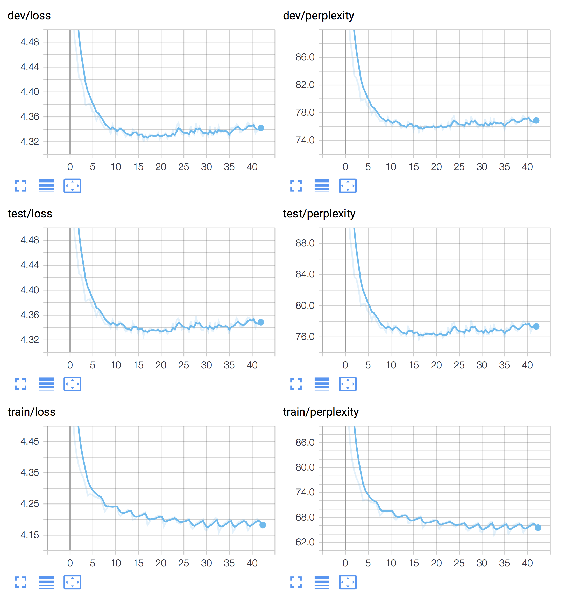
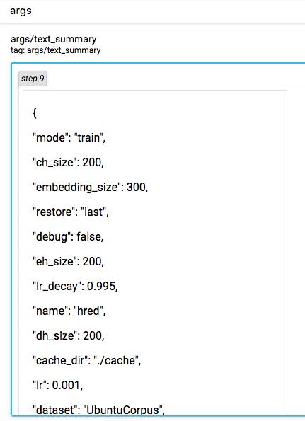

## HRED (TensorFlow)

HRED is a basic model for multiple turn dialog. Here, we implement HRED with attention mechanism. You can refer to the following papers for details:

Serban, I. V., Sordoni, A., Bengio, Y., Courville, A. C., & Pineau, J. (2016, February). Building End-To-End Dialogue Systems Using Generative Hierarchical Neural Network Models. In *AAAI* (Vol. 16, pp. 3776-3784).


### Require Packages

* cotk
* TensorFlow == 1.13.1
* TensorBoardX >= 1.4

### Quick Start

* Downloading dataset and save it to ``./data``. (Dataset will be released soon.)
* Execute ``python run.py`` to train the model.
  * The default dataset is ``UbuntuCorpus``. You can use ``--dataset`` to specify other ``dataloader`` class.
  * It don't use pretrained word vector by default setting. You can use ``--wvclass`` to specify ``wordvector`` class. For example: ``--wvclass gloves``
  * If you don't have GPUs, you can add `--cpu` for switching to CPU, but it may cost very long time.
* You can view training process by tensorboard, the log is at `./tensorboard`.
  * For example, ``tensorboard --logdir=./tensorboard``. (You have to install tensorboard first.)
* After training, execute  ``python run.py --mode test --restore best`` for test.
  * You can use ``--restore filename`` to specify checkpoints files, which are in ``./model``.
  * ``--restore last`` means last checkpoint, ``--restore best`` means best checkpoints on dev.
* Find results at ``./output``.

### Arguments

```none
    usage: run.py [-h] [--name NAME] [--restore RESTORE] [--mode MODE]
                  [--dataset DATASET] [--datapath DATAPATH] [--epoch EPOCH]
                  [--wvclass WVCLASS] [--wvpath WVPATH] [--out_dir OUT_DIR]
                  [--log_dir LOG_DIR] [--model_dir MODEL_DIR]
                  [--cache_dir CACHE_DIR] [--cpu] [--debug] [--cache]
    
    optional arguments:
      -h, --help            show this help message and exit
      
    useful arguments:
      --name NAME           The name of your model, used for variable scope and 
                            tensorboard, etc.
                            Default: runXXXXXX_XXXXXX (initialized by current time)
      --restore RESTORE     Checkpoints name to load. "last" for last checkpoints,
                            "best" for best checkpoints on dev. Attention: "last"
                            and "best" wiil cause unexpected behaviour when run 2
                            models in the same dir at the same time. Default: None
                            (dont load anything)
      --mode MODE           "train" or "test". Default: train
      --dataset DATASET     Dataloader class. Default: OpenSubtitles
      --datapath DATAPATH   Directory for data set. Default: ./data
      --epoch EPOCH         Epoch for trainning. Default: 100
      --wvclass WVCLASS     Wordvector class, none for not using pretrained
                            wordvec. Default: None
      --wvpath WVPATH       Directory for pretrained wordvector. Default:
                            ./wordvec
    
    advanced arguments:
      --out_dir OUT_DIR     Output directory for test output. Default: ./output
      --log_dir LOG_DIR     Log directory for tensorboard. Default: ./tensorboard
      --model_dir MODEL_DIR
                            Checkpoints directory for model. Default: ./model
      --cache_dir CACHE_DIR
                            Checkpoints directory for cache. Default: ./cache
      --cpu                 Use cpu.
      --debug               Enter debug mode (using ptvsd).
      --cache               Use cache for speeding up load data and wordvec. (It
                       	    may cause problems when you switch dataset.)
```

### TensorBoard Example

Execute ``tensorboard --logdir=./tensorboard``, you will see the plot in tensorboard pages:



Following plot are shown in this model:

* train/loss

* train/perplexity

* dev/loss
* dev/perplexity
* test/loss
* test/perplexity

And text output:



Following text are shown in this model:

* args

### Case Study of Model Results

Execute ``python run.py --mode test --restore best``

The following output will be in `./output/[name]_[dev|test].txt`:

```none
perplexity:     74.407300
bleu:   0.089069

post:   anyone knows why my stock oneiric exports env var <unk> I mean what is that used for? I know of $USER but not <unk> . My precise install doesn't export USERNAME <eos>
resp:   looks like it used to be exported by <unk> but the line had the comment <unk> <unk> Is this <unk> so I guess it isn't surprising it is gone <eos>
gen:    you <eos>
post:   looks like it used to be exported by <unk> but the line had the comment <unk> <unk> Is this <unk> so I guess it isn't surprising it is gone <eos>
resp:   thanks! How the heck did you figure that out? <eos>
gen:    I have no idea what that is <eos>
post:   thanks! How the heck did you figure that out? <eos>
resp:   <unk> <eos>
gen:    I <eos>
post:   <unk> <eos>
resp:   nice thanks! <eos>
gen:    I <eos>

post:   i set up my hd such that i have to type a passphrase to access it at boot. how can i remove that <unk> and just boot up normal. i did this at install, it works fine, just tired of having reboots where i need to be at terminal
resp:   backup your data, and re-install without encryption "might" be the easiest method <eos>
gen:    you can install the ubuntu package <eos>
post:   backup your data, and re-install without encryption "might" be the easiest method <eos>
resp:   so you dont know, ok, anyone else? <eos> you are like, yah my mouse doesnt work, reinstall your os lolol what a joke <eos>
gen:    I have no idea what you mean by the <eos>
```


### Performance

|               | Perplexity | BLEU  |
| ------------- | ---------- | ----- |
| UbuntuCorpus  | 74.20 | 0.112 |

### Author

[Zhou Hao](https://github.com/tuxchow)
