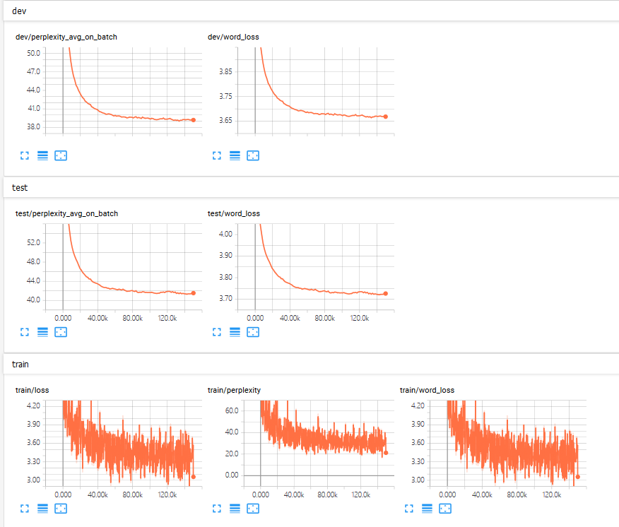
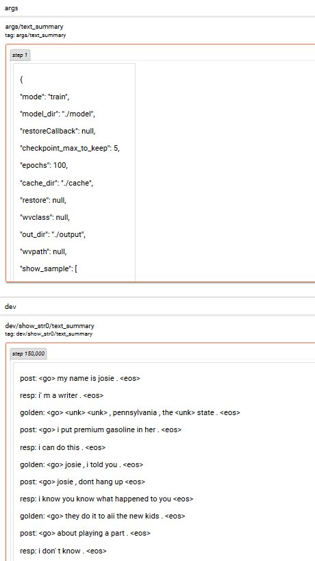

# Seq2Seq (PyTorch)

Seq2seq with attention mechanism is a basic model for single turn dialog. In addition, batch normalization and dropout has been applied. You can also choose beamsearch, greedy, random sample, random sample from top k when decoding.

You can refer to the following paper for details:

Sutskever, I., Vinyals, O., & Le, Q. V. (2014). Sequence to sequence learning with neural networks. In *Advances in neural information processing systems* (pp. 3104-3112).

Bahdanau, D., Cho, K., & Bengio, Y. (2015). Neural machine translation by jointly learning to align and translate. In *International Conference on Learning Representation*.

## Require Packages

* **python3**
* cotk
* pytorch == 1.0.0
* tensorboardX >= 1.4

## Quick Start

* Execute ``python run.py`` to train the model.
  * The default dataset is ``OpenSubtitles``. You can use ``--dataset`` to specify other ``dataloader`` class and ``--datapath`` to specify other data path (can be a local path, a url or a resources id). For example: ``--dataset OpenSubtitles --datapath resources://OpenSubtitles``
  * It doesn't use pretrained word vector by default setting. You can use ``--wvclass`` to specify ``wordvector`` class and ``--wvpath`` to specify pretrained word embeddings. For example: ``--wvclass gloves``. For example: ``--dataset Glove --datapath resources://Glove300``
  * If you don't have GPUs, you can add `--cpu` for switching to CPU, but it may cost very long time for either training or test.
* You can view training process by tensorboard, the log is at `./tensorboard`.
  * For example, ``tensorboard --logdir=./tensorboard``. (You have to install tensorboard first.)
* After training, execute  ``python run.py --mode test --restore best`` for test.
  * You can use ``--restore filename`` to specify checkpoints files, which are in ``./model``. For example: ``--restore pretrained-opensubtitles`` for loading ``./model/pretrained-opensubtitles.model``
  * ``--restore last`` means last checkpoint, ``--restore best`` means best checkpoints on dev.
  * ``--restore NAME_last`` means last checkpoint with model named NAME. The same as``--restore NAME_best``.
* Find results at ``./output``.

## Arguments

```none
    usage: run.py [-h] [--name NAME] [--restore RESTORE] [--mode MODE]
                  [--eh_size EH_SIZE] [--dh_size DH_SIZE] [--droprate DROPRATE]
                  [--batchnorm] [--decode_mode {max,sample,gumbel,samplek,beam}]
                  [--top_k TOP_K] [--length_penalty LENGTH_PENALTY]
                  [--dataset DATASET] [--datapath DATAPATH] [--epoch EPOCH]
                  [--wvclass WVCLASS] [--wvpath WVPATH] [--out_dir OUT_DIR]
                  [--log_dir LOG_DIR] [--model_dir MODEL_DIR]
                  [--cache_dir CACHE_DIR] [--cpu] [--debug] [--cache]

    optional arguments:
      -h, --help            show this help message and exit
      --name NAME           The name of your model, used for tensorboard, etc.
                            Default: runXXXXXX_XXXXXX (initialized by current
                            time)
      --restore RESTORE     Checkpoints name to load. "NAME_last" for the last
                            checkpoint of model named NAME. "NAME_best" means the
                            best checkpoint. You can also use "last" and "best",
                            defaultly use last model you run. Attention:
                            "NAME_last" and "NAME_best" are not guaranteed to work
                            when 2 models with same name run in the same time.
                            "last" and "best" are not guaranteed to work when 2
                            models run in the same time. Default: None (dont load
                            anything)
      --mode MODE           "train" or "test". Default: train
      --eh_size EH_SIZE     Size of encoder GRU
      --dh_size DH_SIZE     Size of decoder GRU
      --droprate DROPRATE   The probability to be zerod in dropout. 0 indicates
                            for dont use dropout
      --batchnorm           Use bathnorm
      --decode_mode {max,sample,gumbel,samplek,beam}
                            The decode strategy when freerun. Choices: max,
                            sample, gumbel(=sample), samplek(sample from topk),
                            beam(beamsearch). Default: beam
      --top_k TOP_K         The top_k when decode_mode == "beam" or "samplek"
      --length_penalty LENGTH_PENALTY
                            The beamsearch penalty for short sentences. The
                            penalty will get larger when this becomes smaller.
      --dataset DATASET     Dataloader class. Default: OpenSubtitles
      --datapath DATAPATH   Directory for data set. Default: ./data
      --epoch EPOCH         Epoch for trainning. Default: 100
      --wvclass WVCLASS     Wordvector class, none for not using pretrained
                            wordvec. Default: None
      --wvpath WVPATH       Directory for pretrained wordvector. Default:
                            ./wordvec
      --out_dir OUT_DIR     Output directory for test output. Default: ./output
      --log_dir LOG_DIR     Log directory for tensorboard. Default: ./tensorboard
      --model_dir MODEL_DIR Checkpoints directory for model. Default: ./model
      --cache_dir CACHE_DIR Checkpoints directory for cache. Default: ./cache
      --cpu                 Use cpu.
      --debug               Enter debug mode (using ptvsd).
      --cache               Use cache for speeding up load data and wordvec. (It
                            may cause problems when you switch dataset.)
```

## TensorBoard Example

Execute ``tensorboard --logdir=./tensorboard``, you will see the plot in tensorboard pages:



Following plot are shown in this model:

* gen/loss (``gen`` means training process)

* gen/perplexity (``=exp(gen/word_loss)``)

* gen/word_loss (``=gen/loss`` in this model)

* dev/loss
* dev/perplexity_avg_on_batch
* test/loss
* test/perplexity_avg_on_batch

And text output:



Following text are shown in this model:

* args
* dev/show_str%d (``%d`` is according to ``args.show_sample`` in ``run.py``)

## Case Study of Model Results

Execute ``python run.py --mode test --restore best``

The following output will be in `./output/[name]_[dev|test].txt`:

```none
perplexity:     48.194050
bleu:    0.320098
post:   my name is josie .
resp:   <unk> <unk> , pennsylvania , the <unk> state .
gen:    i' m a teacher .
post:   i put premium gasoline in her .
resp:   josie , i told you .
gen:    i don' t know .
post:   josie , dont hang up
resp:   they do it to aii the new kids .
gen:    aii right , you guys , you know what ?
post:   about playing a part .
resp:   and thats the theme of as you like it .
gen:    i don' t know .
......
```


## Performance

|               | Perplexity | BLEU  |
| ------------- | ---------- | ----- |
| OpenSubtitles | 51.45      | 0.165 |

## Author

[HUANG Fei](https://github.com/hzhwcmhf)
