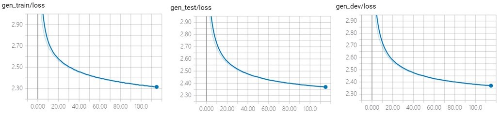
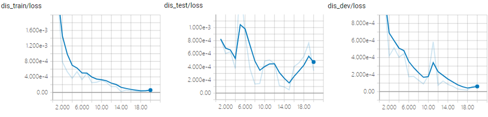
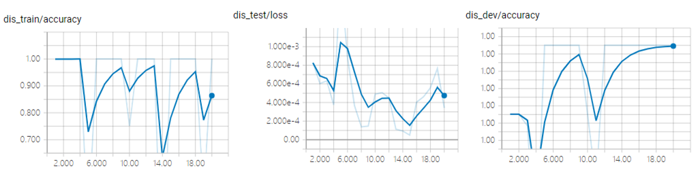

## SeqGAN (TensorFlow)


An implementation of seqGAN language generation model. Refer to the following paper for more details:

Lantao Yu, Weinan Zhang, Jun Wang, Yong Yu. SeqGAN: Sequence Generative Adversarial Nets with Policy Gradient. In *The Thirty-First AAAI Conference on Artificial Intelligence*, 2017.

### Require Packages

- cotk
- TensorFlow == 1.13.1
- TensorBoardX >= 1.4

### Quick Start

- Downloading dataset and save it to ``./data``. (Dataset will be released soon.)
- Execute ``python run.py`` to train the model.
  - The default dataset is ``MSCOCO``. You can use ``--dataset`` to specify other ``dataloader`` class.
  - It use `gloves`  pretrained word vector by default setting. You can use ``--wvclass`` to specify ``wordvector`` class.
  - If you don't have GPUs, you can add `--cpu` for switching to CPU, but it may cost very long time.
- You can view training process by tensorboard, the log is at `./tensorboard`.
  - For example, ``tensorboard --logdir=./tensorboard``. (You have to install tensorboard first.)
- After training, execute  ``python run.py --mode test --restore best`` for test.
  - You can use ``--restore filename`` to specify checkpoints files, which are in ``./model``.
  - ``--restore last`` means last checkpoint, ``--restore best`` means best checkpoints on dev.
- Find results at ``./output``.


### Arguments

```none
    usage: run.py [-h] [--name NAME] [--restore RESTORE] [--mode MODE]
                  [--dataset DATASET] [--datapath DATAPATH]
                  [--wvclass WVCLASS] [--wvpath WVPATH] [--out_dir OUT_DIR]
                  [--log_dir LOG_DIR] [--model_dir MODEL_DIR]
                  [--cache_dir CACHE_DIR] [--cpu] [--debug] [--cache]

    optional arguments:
      -h, --help            show this help message and exit
      --name NAME           The name of your model, used for variable scope and
                            tensorboard, etc. Default: runXXXXXX_XXXXXX
                            (initialized by current time)
      --restore RESTORE     Checkpoints name to load. "last" for last checkpoints,
                            "best" for best checkpoints on dev. Attention: "last"
                            and "best" wiil cause unexpected behaviour when run 2
                            models in the same dir at the same time. Default: None
                            (dont load anything)
      --mode MODE           "train" or "test". Default: train
      --dataset DATASET     Dataloader class. Default: MSCOCO
      --datapath DATAPATH   Directory for data set. Default: ./data
      --wvclass WVCLASS     Wordvector class, None for using Glove pretrained
                            wordvec. Default: None
      --wvpath WVPATH       Path for pretrained wordvector. Default: wordvec
      --out_dir OUT_DIR     Output directory for test output. Default: ./output
      --log_dir LOG_DIR     Log directory for tensorboard. Default: ./tensorboard
      --model_dir MODEL_DIR Checkpoints directory for model. Default: ./model
      --cache_dir CACHE_DIR Checkpoints directory for cache. Default: ./cache
      --cpu                 Use cpu.
      --debug               Enter debug mode (using ptvsd).
      --cache               Use cache for speeding up load data and wordvec. (It
                            may cause problems when you switch dataset.)
```

For hyperparameter settings, please refer to `run.py`.


### TensorBoard Example

Execute ``tensorboard --logdir=./tensorboard``, you will see the plot in tensorboard pages:

Following plot are shown in this model:

- gen_loss: loss when pre-training the generator.

  

- gen_reward: average reward when adversarially training the generator.

  

- dis_loss: loss when pre-training and adversarially training the discriminator.

  

- dis_accuracy: accuracy when pre-training and adversarially training

  


### Case Study of Model Results

Execute ``python run.py --mode test --restore best``

The following output will be in `./output/[name]_test.txt`:

```none
self-bleu-4:0.129181
bw-bleu-4:0.464359
fw-bw-bleu-2:0.569625
fw-bleu-4:0.124722
fw-bleu-2:0.422881
fw-bw-bleu-3:0.325708
bw-bleu-3:0.662481
self-bleu-3:0.243009
fw-bleu-3:0.215936
fw-bw-bleu-4:0.196631
bw-bleu-2:0.872336
self-bleu-2:0.471246
A view of a taxi at night with two streetlights .
An goods vendor waiting for food to be made from the ceiling .
Pizza with forks , cucumbers , pickle and strawberry on top .
A man riding a wave on top of a surfboard .
A close view of an old toilet in a boat .
A red aircraft hanging at an airport runway .
A group of young men standing around a clock in a field .
Two soldiers eating doughnuts are looked out on the ground .
Cats blankets are on the floor with things behind them .
A bunch of people in dining area that are near .
A beach area with lots of yellow benches and cars on the back .
A plate holds a sandwich and mashed potatoes and cheese .
The keyboard is above the monitor as well .
A tennis player going one just after a tennis ball .
A man wearing winter skis admires a <unk> .
Some people on a bike row of motorcycles .
An airplane parked at the airport in the large city .
People walking down a street outside , at night .
A white cat laying on top of a bed .
...
```


### Performance

|        | self-bleu-2 | self-bleu-3 | self-bleu-4 | fw-bw-bleu-2 | fw-bw-bleu-3 | fw-bw-bleu-4 |
| :----: | :---------: | :---------: | ----------- | ------------ | ------------ | ------------ |
| MSCOCO |   0.4712    |   0.2430    | 0.1292      | 0.5696       | 0.3257       | 0.1966       |


### Author

[Jian Guan](https://github.com/JianGuanTHU)
